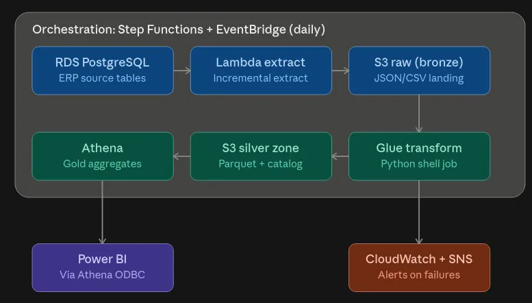
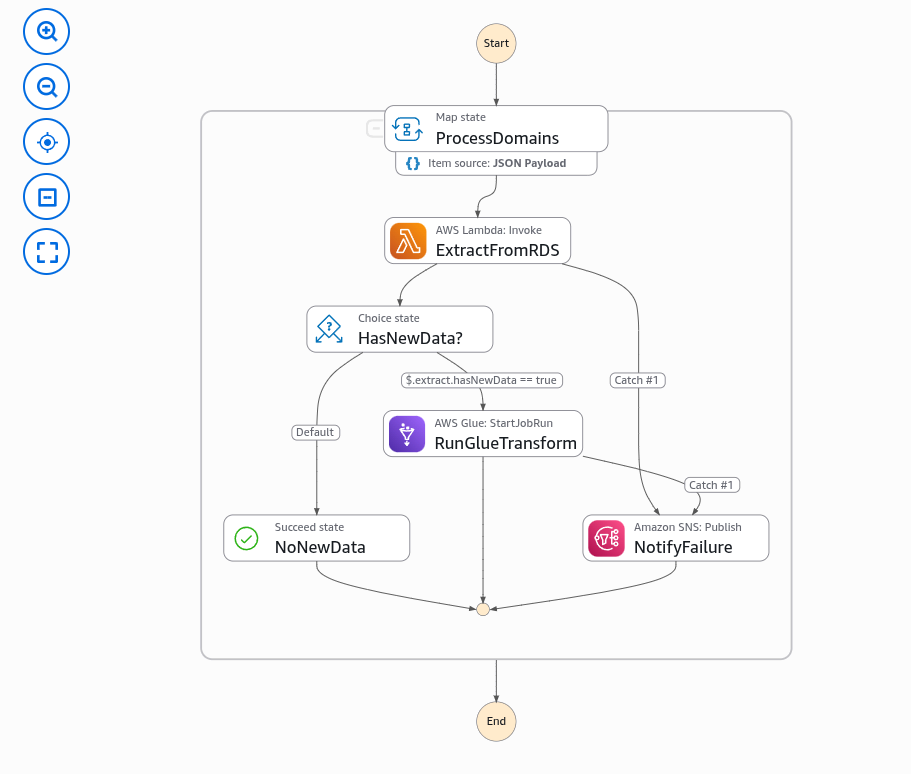
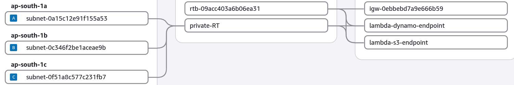

# ERP AWS ELT Pipeline


## Executive Summary

A serverless, event-driven **ELT pipeline on AWS** that incrementally moves
daily ERP transactional data — Purchase Orders, GRN, and Issues — from an
operational **RDS PostgreSQL** database into a queryable analytics layer in
**Amazon Athena**, with zero servers to patch.

This project's primary purpose is to demonstrate hands-on AWS
data-engineering skills — Lambda, Glue, Step Functions, EventBridge, Athena,
IAM, DynamoDB, RDS — end to end. It isn't tied to a specific reporting gap;
the Power BI report shown below is borrowed for illustration (see the
[Dashboard & Reporting](#-dashboard--reporting) section).

---

## System Architecture



**The data flow:**

1. **Extraction** (staggered daily — 11:00 / 11:15 / 11:30 AM IST): a Lambda
   function pulls new or changed rows for one domain from RDS PostgreSQL,
   using a watermark stored in DynamoDB (`(last_updated, id) > (:last_ts,
:last_id)`), then exports straight to S3 via the `aws_s3` Postgres
   extension — the write is done by the **RDS instance's own IAM role**, not
   the Lambda's.
2. **Landing (bronze)**: CSV lands at
   `s3://.../elt_rds_dumps/{domain}/year=YYYY/month=MM/`.
3. **Transform (Glue, only when new data exists)**: dedupes to the latest
   version of each `id` within the batch, partitions by year/month, writes
   Parquet to the silver zone, and registers the table + partitions
   directly in the Glue Catalog (`enableUpdateCatalog`) — no crawler.
4. **Gold layer (Athena views)**: five business views join across the three
   domains — supplier, department, item and cost-project master data, plus
   a PO→GRN reconciliation view.
5. **Orchestration**: Step Functions runs extract → conditional transform →
   failure alert per domain; EventBridge Scheduler triggers it, staggered
   to respect DynamoDB's provisioned throughput (see below).
6. **Alerting**: any Lambda or Glue failure publishes to SNS, which emails
   a subscriber.

### DynamoDB watermark schema

| Attribute      | Type   | Role                                                  | Example                                                           |
| -------------- | ------ | ----------------------------------------------------- | ----------------------------------------------------------------- |
| `id`           | String | Partition key                                         | `ISSUE`                                                           |
| `date`         | String | Sort key — `last_updated` of the newest row processed | `2026-01-05T17:39:08.484169`                                      |
| `last_id`      | Number | Tiebreaker for the compound watermark                 | `341317`                                                          |
| `s3_key`       | String | Where that batch landed                               | `elt_rds_dumps/ISSUE/year=2026/month=09/dump_20260916T205319.csv` |
| `record_count` | Number | Rows in that batch                                    | `500`                                                             |

Billing mode: **Provisioned**, 1 RCU / 1 WCU, autoscaling off.

---

## 🔀 Orchestration



Standard Step Functions workflow, `ERP-Pipeline`: a `Map` state
(`ProcessDomains`) invokes the Lambda, branches on whether new data was
found, and runs the Glue job only when there's something to transform. Any
failure — Lambda or Glue — is caught and routed to SNS instead of failing
silently. Full definition: [`step_functions/state_machine.asl.json`](step_functions/state_machine.asl.json).

**Why staggered, not parallel:** `dynamoDb-watermarks` is provisioned at
1 RCU / 1 WCU. Running all three domains through the Map state at once
risked throttling on the watermark table's `Query`/`PutItem` calls, so
three separate EventBridge schedules fire the same state machine 15
minutes apart with a single-domain payload each, instead of one schedule
handling all three concurrently. Details: [`eventbridge/schedules.md`](eventbridge/schedules.md).

---

## Networking



Lambda and RDS sit in private subnets across three AZs
(`ap-south-1a/b/c`). DynamoDB and S3 are reached over **VPC Gateway
Endpoints** (`lambda-dynamo-endpoint`, `lambda-s3-endpoint`) rather than a
NAT Gateway — no per-hour NAT cost, and no public route needed for either
service.

---

## IAM — one scoped role per hop

| Role                                 | Purpose                   | Key permissions                                                                                          |
| ------------------------------------ | ------------------------- | -------------------------------------------------------------------------------------------------------- |
| `StepFunctions-Orchestrator-Role`    | Runs the state machine    | Invoke the Lambda; start/monitor the Glue job; publish to SNS                                            |
| `send_daily_rds_data_to_s3-role-*`   | Lambda execution          | CloudWatch Logs + VPC ENI (AWS-managed default); DynamoDB read/write, scoped to the watermark table only |
| Glue job role                        | Glue execution            | `AWSGlueServiceRole` (managed) + read bronze / read-write silver / publish to SNS, scoped to this bucket |
| RDS instance role                    | `aws_s3` extension export | `s3:PutObject` / `AbortMultipartUpload`, scoped to the bronze prefix only                                |
| `Amazon_EventBridge_Scheduler_SFN_*` | Triggers the pipeline     | `states:StartExecution` on this one state machine                                                        |

Full policy JSON in [`iam/`](iam/). **Account ID is redacted to
`<ACCOUNT_ID>` throughout** — swap in your own before deploying.

One deliberate removal: the Lambda's role originally also carried
`s3:PutObject` on the bronze prefix. Dropped — the actual S3 write happens
via `aws_s3.query_export_to_s3` _inside Postgres_, authenticated by the RDS
instance's own role, never the Lambda's.

---

## Gold layer (Amazon Athena)

Workgroup: `primary` · Glue database: `erp_silver`.

Glue Catalog lowercases table names on creation, so the physical tables
are `grn`, `issue`, `pur` — not the `*_daily_main` names the business
views below expect. Three thin compatibility views bridge that gap:
[`sql/compatibility_views.sql`](sql/compatibility_views.sql). Run that
first, then [`sql/gold_views.sql`](sql/gold_views.sql), which merges
across domains into five views: supplier, department, item and
cost-project master data, plus a PO→GRN reconciliation view (`pur_grn`).

---

## Dashboard & Reporting

> _Dashboard preview below is illustrative — reused from a separate Power
> BI report built over the same business domain (PUR/GRN/ISSUE); this
> pipeline's own Athena-backed report is pending a screenshot once AWS
> Glue is verified. See
> [scm-data-bridge](https://github.com/ShubhrajyotiPoddar/scm-data-bridge)
> for the original._

---

## Known limitations

- **Glue execution**: pending AWS account verification as of this
  writing. The Lambda → S3 extraction path is built and reviewed; the
  Glue transform, Athena gold layer, and Power BI connection have not yet
  run end-to-end in this account.
- Once Glue's verified: run `sql/compatibility_views.sql` then
  `sql/gold_views.sql`, confirm the physical table names with `SHOW
TABLES IN erp_silver;`, and take a fresh, Athena-backed dashboard
  screenshot to replace the borrowed one above.

---

## Repository structure

```
.
├── src/
│   ├── lambda/          final_lambda.py, requirements.txt
│   └── glue/            glue_transform.py
├── step_functions/      state_machine.asl.json
├── iam/                 7 policy files (roles + resource policies)
├── sql/                 compatibility_views.sql, gold_views.sql
├── eventbridge/         schedules.md (3 staggered triggers)
└── architecture/        pipeline diagram, execution graph, VPC diagram
```

---

## Tech stack

Python (`boto3`, `pg8000`) · AWS Lambda · AWS Glue (PySpark) · Step
Functions · EventBridge Scheduler · Amazon Athena · Amazon S3 · Amazon
DynamoDB · Amazon RDS (PostgreSQL) · Amazon SNS · IAM · Power BI

## Author

**Shubhrajyoti Poddar** — Data Engineer | BI Analyst
[GitHub](https://github.com/ShubhrajyotiPoddar)
